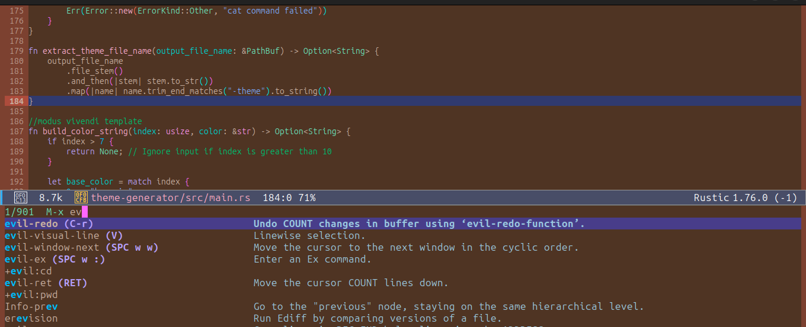
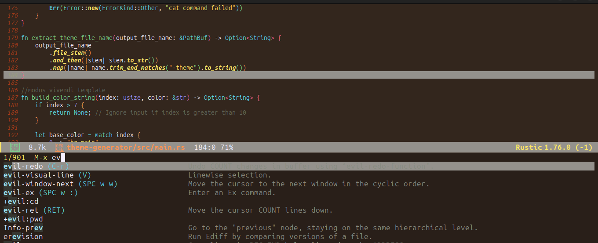
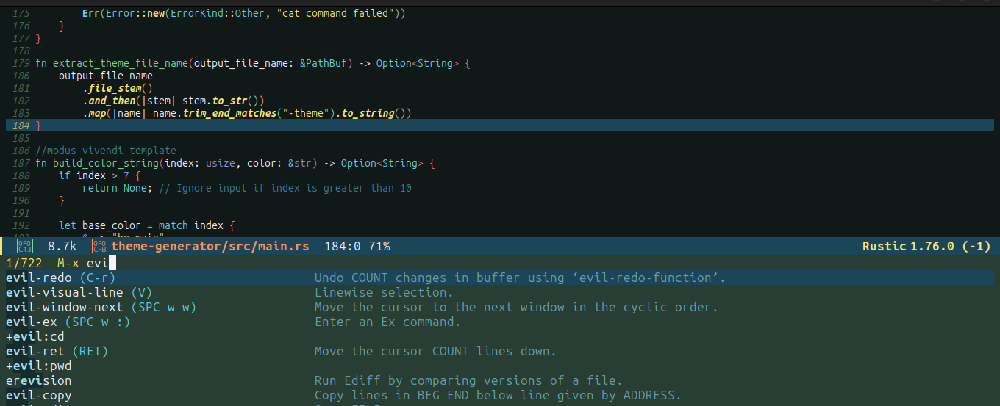

# Emacs themes generated with the theme-generator.

See -> [Theme Generator](theme-generator/)

Modus-vivendi-tinted variations and monokai-spectrum

## empack1-modus-vivendi-tinted-theme.el

## empack2-modus-vivendi-tinted-theme.el

## empack3-modus-vivendi-tinted-theme.el

## empack4-modus-vivendi-tinted-theme.el

## empack5-modus-vivendi-tinted-theme.el

## empack6-modus-vivendi-tinted-theme.el

## empack7-modus-vivendi-tinted-theme.el

## empack1-monokai-spectrum-theme.el

## empack2-monokai-spectrum-theme.el

## empack3-monokai-spectrum-theme.el

## empack4-monokai-spectrum-theme.el

## empack5-monokai-spectrum-theme.el

## empack6-monokai-spectrum-theme.el

## empack7-monokai-spectrum-theme.el

## empack8-monokai-spectrum-theme.el

## empack9-monokai-spectrum-theme.el

## empack10-monokai-spectrum-theme.el

